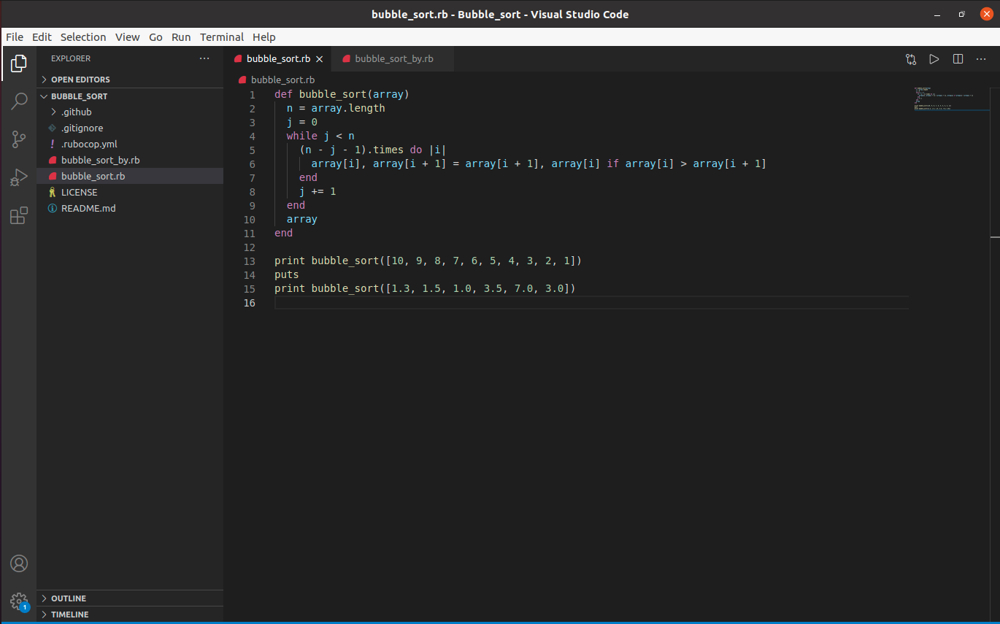
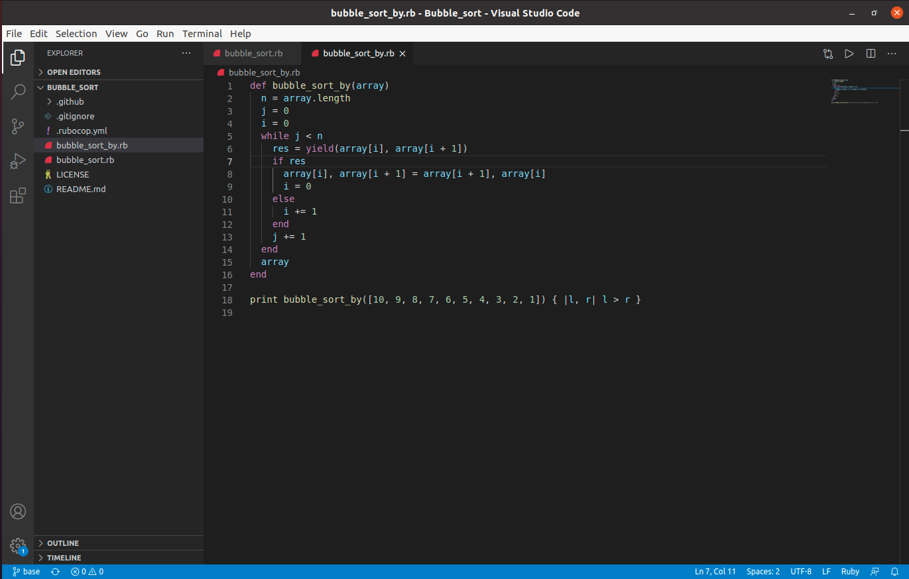

# Bubble_sort

Bubble_sort, as the name suggest is a implementation of bubble sort algorithm in ruby here in bubble_sort_by.rb I have used yield in place of second loop.

## Built with

ruby

## Authors 👤

### Shweta Srivastava

_[Github](https://github.com/vidhishweta01)

_[LinkedIn](http://linkedin.com/in/shweta-s-15a57070)

## Show your support ⭐️⭐️

Give a star if you like this project!

## License 📝

This project is [MIT](https://www.mit.edu/~amini/LICENSE.md) licensed.